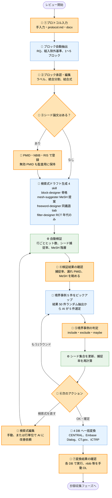

# 司書向けフローチャート（モック）

- **対象**: 情報専門家（司書）としてこのツールを使う方
- **目的**: ツールが何を自動化し、**どこで司書さんの判断が必要になるか**（Human-in-the-Loop, HITL）を一枚で見ていただき、ご意見をいただくためのモック
- **作成日**: 2026-04-17 ／ ステータス: 要件定義フェーズ（実装未着手）

---

## 全体フロー

凡例:

- 🤖 = AI が自動でやる処理
- 👤 = **司書さんの入力・判断が必要**（HITL ポイント）
- ⚙️ = ツールが自動で走るロジック（AI を使わない検証・変換など）

---

## HITL ポイント一覧（= 司書さんに必ず判断をお願いする箇所）

| # | タイミング | 司書さんの操作 | 備考 |
|---|---|---|---|
| ① | プロトコル入力 | RQ・組入除外・元テキストを入力 or アップロード | `.md` / `.docx` どちらでも可 |
| ② | ブロック承認 | AI が抽出した 1〜5 ブロック（例: Population / Intervention …）を承認 or 編集。結合式（`#1 AND #2`）も編集可 | PICO 固定ではなく汎用ブロック |
| ③ | シード論文登録 | 既知の重要論文（PMID）を登録。無くても OK（後で拾う） | NBIB / RIS ファイルの丸ごと投入も可 |
| ④ | 検証結果の確認 | 捕捉率・行ごとのヒット数・MeSH 階層を見て問題点を確認 | AI は「漏れ PMID の原因分析」も添える |
| ⑤ | 境界事例の判定 | AI が選んだ 5 件を include / exclude / maybe で判定 | ショートカット `i` / `e` / `m` |
| ⑥ | 次アクション選択 | 「もう 1 ラウンド」「検索式を直す」「確定」を選ぶ | ループは何度でも |
| ⑦ | 変換結果の確認 | 4 DB（CENTRAL / Embase / CT.gov / ICTRP）の検索式を確認し、各 DB サイトで実行・ダウンロード | ダウンロード自体は司書さんが手動で |

---

## 特別な HITL（例外発動時のみ）

- **ヒット数が過大（暫定 50,000 件超）** のとき、AI が追加フィルタ候補（言語・publication type 等）を提示し、**司書さんの承認なしには追加しない**。
  - 背景: AI は放っておくと `English[lang]` や `Humans[mh]` を勝手に足して**感度を下げがち**なので、この拡張では明示承認を必須にしています。
  - デフォルトで許可されているフィルタは **Cochrane RCT フィルタ（study_design が RCT のとき）** と **プロトコルに明記された年代のみ**です。

---

## 本拡張が "やらない" こと（スコープ外）

以降のフェーズは別ツールに渡します。司書さんの業務範囲と合っているかをご確認ください。

- スクリーニング（タイトル・抄録レビュー）→ `tiab-review-plugin` に引き渡し
- 重複除去
- 全文 PDF 取得
- データ抽出
- PRISMA 記述ブロックの自動生成
- ERIC / Ovid 形式への変換（将来検討）

---

## ご意見をいただきたいポイント

1. **HITL の粒度は適切ですか？** 「ここはもっと人が介入したい」「ここは任せていい」などあれば教えてください。
2. **②ブロック承認 UI** は、PICO 固定ではなく 1〜5 個の汎用ブロックにしています（スコーピングレビューや SPIDER 等にも対応）。実務上これで足りますか？
3. **⑤境界事例の判定を 5 件 / ラウンド**にしていますが、件数・ラウンド数の感覚はどうですか？（件数が多いと疲労、少ないと収束しない）
4. **③シード論文**は、NBIB / RIS の丸投げを想定しています。普段どの形式で手元に持っていますか？
5. **⑦変換結果**の受け取り方: `.md` ダウンロード → 各 DB サイトで貼り付け、の流れで問題ないですか？ 他にほしい出力形式はありますか？
6. **フィルタの扱い**（`English[lang]` や `Humans[mh]` をデフォルト off にする設計）は、日常業務の感覚と合っていますか？
7. ここに書かれていない **「司書がやりたいけどツール側でサポートされていない操作」** はありますか？
