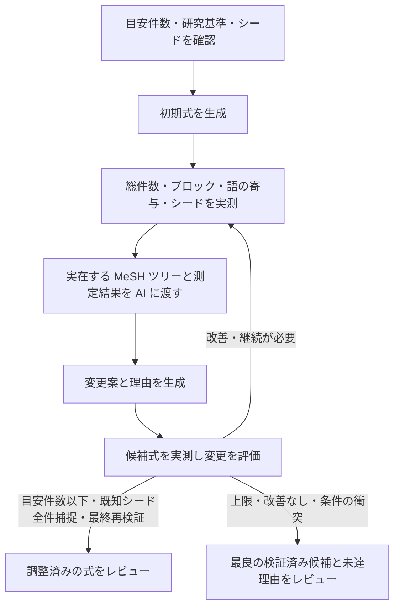

# 件数・MeSH ツリー・シード捕捉を使う検索式の自動調整案

2026-09-11。Issue [#97](https://github.com/youkiti/sr-query-builder-plugin/issues/97) に関連する設計案。調査対象は `59e1dfa`。**分割 1〜3 は実装済み。`#/draft` で開始設定・実行・ライブ履歴・最終レビュー・採用保存を利用できる。E2E の追加シナリオは実装済みで、実ブラウザでの実行確認は別途必要。**

## 目指す体験

利用者が最初に PubMed の目安件数を設定する。研究基準とシードから検索式を作り、実測結果を AI に返して、MeSH の上下移動・語の追加や削除を反復する。シードが捕捉されることを実測し、調整済みの式を人のレビューへ渡す。

途中の修正ごとに採用ボタンを押させない。実行中は、現在の作業、変更理由、件数と捕捉の変化、採用されなかった試行も見られるようにする。Issue #97 の削除機能とフリーワードの整理は、この自動調整の操作として統合する。



## 開始画面

- 入力のそばに「スクリーニングする量の目安です。超えても検索式の誤りではなく、適格な文献を落としてまで合わせるものではありません。」と表示する。
- 主入力は「PubMed の目安件数」。初期値は 2,000 件（自動調整専用。過大ヒット時フィルタ提案の 10,000 件とは別）。整数必須、プロジェクトごとに前回値を保持する。
- 上限は最終結合式の件数に適用する。各概念ブロックの単独件数に同じ上限を課さない。
- 組入・除外基準、承認済みブロック、検証対象シード件数を開始前に表示する。
- 開始ボタンは「検索式を作成・自動調整する」。詳細設定に反復上限を置く。初版の既定は最大5回の AI 修正案評価とする。
- シードは既存の `isSeedEligibleForValidation` に従い、PMID を重複除去する。対象数より目安件数が少ない場合は、両条件を満たせないので開始前に入力エラーを示す。
- シード0件なら登録・既存のシード候補探索へ誘導する。基準だけで生成する既存経路は利用できるが、「シード確認済みの自動調整完了」にはしない。
- 初版では現在のプロトコル・ブロック承認・シード入力を維持し、その後の `#/draft` で目安件数を設定する。

## 調整の判断

最終レビューは「既知文献の捕捉 / 目安件数 / 外側の確認 / 削除影響の確認」の 4 区分で、確認済み・未達・判定待ち・判定済み（残件あり）・未確認の 5 つの状態を文字で示し、未確認事項を列挙する。同じ算出結果をチェックポイントの終了記録と採用保存の Drive 実行ログへ保存する。

「目安件数と既知シードの捕捉を満たしました」または「要確認」で終了したら、最良候補の式に対して margin（拡張式 NOT 現式）探索を自動実行する。これは自動調整の通信予算 200 回とは別枠である。停止・取得失敗でも自動調整本体の終了状態は変えず、外側の確認を未確認として残す。候補は出版年代・用語・介入（曝露）の多様性を意識して選ぶ。

外側の境界事例と、保留候補で失う文献を人が include / exclude / maybe と判定し、SeedPapers に source=interactive で記録する。maybe / exclude を include に格上げせず、AI の理由で人の判定を代替しない。保存済み include があれば、その文献を保護して同じ目安件数・反復上限で再調整できる。開始式は最良候補、シードは再取得し、新しい run として実行する。再調整は現在の最終候補を保存しないため、残す場合は先に「採用して保存」を行う。失う集合から抽出した K 件を判定しても、全体 L 件の残り L−K 件は未確認と表示し続ける。

候補がすべて保存済みで include がなく、maybe が残る区分は「判定済み（残件あり）」として未確認事項に出す。未保存の候補があれば「判定待ち」、すべて保存済みで include があれば「未達」を優先し、保存済み maybe の件数と未確認として残る旨はどちらの場合も示す。外側の判定候補が 0 件の場合は「確認済み」のままとし、候補が選ばれなかった旨を行で示す。削除影響の確認は、保留候補がない場合を除き、すべての保留候補で失う集合の書誌を全件取得し、判定候補がすべて exclude で保存済みのときだけ「確認済み」とする（PMID で照合し、登録済みシードとして判定候補から除いた書誌は確認を妨げない）。書誌を出していない残り・失う件数の未測定・取得失敗があれば、exclude だけでも「判定済み（残件あり）」（判定候補がなければ「未確認」）として未確認事項に残す。書誌の一部を判定しても集合全体の確認にはならない。

相対目標（初期式の実測件数に対する比率で上限を決める案）は未実装で、評価ハーネスで同一初期式の対比較ができるようになってから判断する。

未捕捉シードがある間は、対象ブロックのシード捕捉が増え、最終捕捉数が減らない候補を中間手として採用する（捕捉済みシードを失わず、差集合の採用条件も満たす場合）。候補の対象ブロックだけを esearch 1 通信で測り、変更前の行がない・測定失敗の場合は従来の最終捕捉数増加で判定する。最終捕捉数が増えない採用が承認済みブロック数と同じ回数続いたら要確認で停止し、中間手の採用理由は履歴と最終レビューの「既知文献の捕捉」に残す。

未捕捉シードがある間は、全ブロックのシード × ブロック捕捉表と未捕捉書誌（抄録・MeSH を含む）を AI に渡す。
削除案は測定前に却下し、同義語追加・MeSH 拡張による回収を優先する。説明された置換は実測する。
承認外ブロック・結合構造が落としているシードは語の調整では回収できないと診断する。
最終レビューに診断とブロック承認（#/blocks）へ戻る導線を出し、検索概念・フィルタの見直しを促す。

採用判定を通った候補だけ、変更前 NOT 変更後（失う集合）と逆方向（増える集合）を実測する。
失う集合が 1 件でもある候補、または差集合の実測に失敗した候補は自動採用せず、レビュー候補として保留する。
保留は最良式を更新しない。失う集合を 1 件以上実測した保留は成果として改善なし回数を 0 に戻し、run ごとに 3 件で held_candidates_collected（要確認）で停止する（増える集合だけの測定失敗も数える）。失う集合が未測定、または失う 0 件・増える集合が未測定の保留は従来どおり改善なしに数える。採用は改善なし回数を 0 に戻し、却下は測定前を含めて 1 加算する。run あたりの上限（3 回）内の情報要求はどちらの回数も変えない。上限を超えた情報要求は改善なし回数に 1 加算する（held のカウンタは変えない）。保留カウンタは再開した run でも 0 から数え、設定や再開予算には含めない。

最終レビューは保留候補ごとに「この候補を採用して保存」「これを初期式に再調整」「除外」を出し、人が失う集合を処理できる（issue #172）。「この候補を採用して保存」は候補ごとのゲートを満たすときだけ押せる: 失う集合が既定 100 件以下（定数）なら全件の書誌を取得し、全件判定済みであること、超過なら標本（最大 20 件）を全件判定済みであることを要求する。ここで「判定済み」は保存済み `exclude` のみを数え、`maybe` は未確認として扱う。失う文献に `include` と判定したものが 1 件でもあれば、件数にかかわらず採用できない。ゲートは既存の `deletion.state`（4 区分の確認状況）とは別の、候補単位の判定で、しきい値以下でも標本が全体を覆わない限り「20 件を見たから安全」とは書かない。採用保存は run につき 1 回で、最良候補・保留候補のどちらが保存されたかを表示する。「再調整」はその候補の式を初期式に新しい run を始める（include 保護は課さない）。「除外」は人の判断としてチェックポイントへ残し、同じプロジェクトで次に始める run（中断からの再開・保留候補からの再調整を含む）はその式を測定前に却下する（AI 由来の却下・保留とは区別し、取り消すと記録も消える）。除外記録は新しい run の保存でも引き継ぎ、終了済み run の予算再開は許可しない。同じチェックポイントキーの更新は直列化し、除外・取消の保存中は全候補の「除外」「除外を取り消す」ボタンを無効化して保存中と表示し、成功・失敗のどちらでも再び操作可能にする。失敗時は表示を操作前へ戻して警告ログを残す。既知シード（SeedPapers にあり exclude / maybe でない文献）を失う保留候補は採用できない。最終的な最良候補が捕捉している既知シードを失う候補も採用できず、失う PMID を理由に表示する。最良候補または保留候補の捕捉集合が未測定なら、比較できないため採用不可とする。閾値超過では、標本として抽出した PMID の全件について書誌取得と exclude 判定の保存を要求し、取得漏れを標本の縮小とは扱わない（抽出情報のない旧記録は取得済み書誌を基準とする）。書誌の未取得と判定不足は理由文で区別する。未判定の initial シードは「未判定の既知シード」として PMID 付きの拒否理由を表示し、include 判定とは区別して判定件数・採用監査の判定済み件数に含めない。既知シードの判定カードは重複表示しない。SeedPapers の保存済み判定も PMID 単位でゲートへ引き継ぐ（exclude は判定済み、include は採用不可、maybe は未確認）。複数候補の標本に同じ PMID があっても一度の判定が双方へ効く。失う集合の実測と書誌取得が成功していれば、増える集合だけの測定失敗では手動採用を妨げない。採用保存の再試行で対象を切り替えた場合は、対象ごとに固定した版 ID・監査ファイル・検証ログを使い、同じ対象の再試行では重複を作らない。エラー後に対象を切り替える場合は、保存を始める前に前回試行の版 ID も照会する。既に保存済みなら新しい版を追加せず、前回の候補を採用済みとして確定・表示し、対象を切り替えても run につき 1 回の採用保存を守る。前回の版が存在しない場合のみ新しい対象へ進む。同じ版 ID の再試行では照会を増やさない。失う集合が 1,000 件（定数）を超える候補は、標本の判定結果にかかわらず採用できず、「この候補を採用して保存」自体を出さない（「これを初期式に再調整」「除外」は出す）。実 API の評価で、失う集合が 1,000〜13,000 件で held-out の適格研究を 7〜10 件失う候補でも、無作為標本 20 件に適格文献が 1 件も入らなかったため（issue #172）。あわせて、標本をすべて exclude と判定しても否定できない適格文献の件数の上限（片側 95%）を保留候補カード・最終レビュー・採用監査に表示・記録する。この上限は表示・監査用の参考値で、採用ゲートの判定には使わない。

失う集合は esearch 1 回で最大 10000 件の PMID を取得し、重複除去・数値昇順への整列後、失う集合が閾値（既定 100 件）以下なら全件の書誌を取得し、超過するときだけ種付き乱数で最大 20 件を非復元一様抽出する。efetch には抽出 PMID を数値昇順で渡す。通信は差集合 esearch 2 回と efetch 最大 1 回のまま。全件数が 10000 以下で取得 ID 数と一致する場合は `all`（全件からの抽出）、それ以外は `retrieved_subset`（取得できた PMID からの抽出）として記録する。10000 件を超える場合は既定の新しい順の先頭 10000 件が母集団となり、古い文献は抽出対象に入らない。ID 欠落時も集合全体からの無作為抽出ではない。0 件なら抽出情報は付けない。種・抽出時刻・母集団件数・取得件数・抽出 PMID を残し、書誌取得に失敗しても抽出記録は保持する。旧データは従来の先頭の数件として表示する。確認書誌は集合全体の安全性の根拠や AI による採否判定には使わず、全件の書誌が揃うまでは残りを未確認とする。

「研究基準を維持する」「既知の適格シードを失わない」を優先し、その範囲で目安件数に近づけることを目指す。目安件数を超える場合は件数の区分を未達として返すが、検索式の誤りを意味しない。目安だけを満たすために、プロトコルにない期間・言語・対象集団の制限や PMID 指定を追加しない。シードの include/exclude 判定も変更しない。

件数が少ないことだけで語を不要とは決めない。単独件数、ブロックでの固有寄与、最終結合式での固有寄与、シード捕捉への影響を区別する。

| 状態 | 自動調整での扱い |
|---|---|
| フリーワード単独が実測0件 | 綴り・タグ・切り詰めを AI が確認し、修正または削除を試す |
| 除去しても検索集合が変わらない | 全件捕捉後、捕捉済みシードを失わず、削除のみ（追加・置換なし、実式差分にも追加なし）で件数が同じとき、差集合で失う 0 件かつ増える 0 件を実測すれば冗長整理として自動採用する。不成立・未測定は保留せず、差集合と失敗理由を残して却下する |
| 固有寄与がごく小さい | 低寄与候補として AI に渡す。基準との関係と、失われる論文を確認して削除・修正・保持を選ぶ |
| 少数でもシードを拾う／必要な概念を表す | 保持または代替表現を試し、再検証する |
| 目安件数超過 | 広すぎる MeSH の下位語への置換、基準に合わない語の削除などを試す |
| シード未捕捉 | どのブロックが漏らすか測り、MeSH の上位化や同義語追加を試す |
| API エラー・未解決・数値異常 | 「不明」。0件・寄与なしとして削除しない |

低寄与の初期しきい値案は、最終式での固有寄与が「3件以下かつ全体の0.1%以下」。既存の相対1%判定をそのまま自動削除には用いない。この数値は実装時に設定可能な内部ポリシーとして持ち、実例で調整する。

保留候補ごとに 1 回、書誌を取得できた失う集合の標本を AI に研究基準と照合させ、参考注釈を付ける。採否・ゲート・状態区分・停止判定には使わず、人の include / exclude / maybe の判定カードにも出さない。少数の固有文献こそ重要なことがあり、AI の推定を安全証明にしないため。注釈の取得に失敗しても run は続行するが、停止要求・通信予算切れ・時間予算切れでは実測済み候補を保存して停止する。

シード全件捕捉は、既知の論文に対する確認であり、未知の適格研究の網羅性を意味しない。そのため、最終表示は「既知シード N/N 件捕捉」とする。既知の研究だけに偏った検索を避けるという方針は [Cochrane Handbook, Chapter 4](https://www.cochrane.org/authors/handbooks-and-manuals/handbook/current/chapter-04) にも沿う。

## ブロック構造の診断

初期式の実測・シード捕捉の後、最初の AI 呼び出しの前に機械的な診断を行う。対象は最終結合ブロックが参照を単純な AND だけで結んだ式の場合の、承認済み概念ブロック。OR・NOT・括弧を含む結合式や結合ブロックのない式は全体を未判定にする。承認外の固定ブロック（研究デザインフィルタ等）は診断対象から外すが、件数を比較する両方の式に残す。

- 構造診断: ブロックのペアごとに同じ MeSH descriptor と、explode する上位語による子孫語の内包を検出する。完全一致の tree number は祖先としない。出現ごとの元表記・explode・NOT 側・修飾を保持し、NOT 側は使わない。NOT 直後の括弧は内側全体を NOT 側とする。副標目・MajorTopic は修飾付きと明示する。階層不明や取得失敗は unknown と理由を記録し、重なりなしとは扱わない。既存の MeSH 文脈を優先し、不足 descriptor だけ取得する。
- 階層不明の集約: same / ancestor は組み合わせごとの行を残し、それらに該当しない組み合わせの unknown はブロックのペアごとに最大 1 行にまとめる。階層を取得できなかった出現だけを重複なくブロック順・出現順に terms へ保持し、いずれかが修飾付きなら行も修飾付きにする。説明には各出現と取得失敗の理由（なければ「階層不明」）を先頭 10 件まで列挙し、超過分は「ほか N 件」とする。
- 件数診断: 初期実測の最終件数 Q を再利用し、各対象ブロックの参照だけを外した Q−i を retmax: 0 で 1 回測る。削減率は 1 − Q / Q−i、13% 未満を「絞り込みに効いていない」とする。13% ちょうどは含めない。閾値は凍結 C0 43 本・判定できた 100 ブロックの分布で校正した値で、分布の下側で最も広い切れ目（9.8%〜17.0%）の中点に最も近い丸め。誤検出は実際に効いているブロックを狭めさせ diagnosed_block_held の早期停止も招くため、切れ目の中に置いて誤検出側を減らす。Q が不明、参照が残らない、Q−i の失敗・0 件・Q より小さい場合、予算による未測定は理由付きの未判定にする。
- 通信: 件数診断を優先し、その後に MeSH 階層を取得する。診断全体で最大 30 HTTP、既存の全体予算（既定 200 回）にも加算する。MeSH の descriptor ごとの esearch とまとめた esummary も実 HTTP として数え、候補評価・差集合・最終再検証の予約予算は使わない。予算不足は残りを未判定にし、停止例外は通常の取得失敗に変換しない。
- 更新: 採用後は新しい式の fingerprint に切り替え、構造を取得済みの階層だけで再計算する。診断用の階層は、取得済みの tree number と MeSH 文脈の同じ descriptor の全ノードの tree number の和集合で保持する。Q−i の展開式が変わった測定だけを残予算内でやり直し、不変な Q−i は再利用して新しい Q から削減率を算出する。測れない場合は「式の変更後に再測定していない」と記録し、古い値を最新として表示しない。
- 提示と保存: 診断を AI 入力と最終レビューの「ブロック構造の診断」に参考情報として表示する。重なり・削減率・未判定理由を行ごとに示し、4 区分の状態判定には追加しない。進捗状態、チェックポイント、採用時の Drive ログにも fingerprint とともに保存する。
- 優先順位混在の診断（issue #202）: 承認済み概念ブロックの式に、括弧の無い AND/NOT と OR が同じ括弧グループ（括弧で囲まれていない同じ並び。同じ深さでも別々の括弧は別グループとして区別する）に混在しているものが無いかを機械的に検出する。PubMed は結合演算子を左から評価するため、`a OR b AND c` は `(a OR b) AND c` にも `a OR (b AND c)` にもならず、意図と違う集合になる。この診断は最終結合ブロックが単純な AND かどうかに依存せず、承認済み概念ブロックの式単体だけで毎回計算する（構造診断・件数診断が「結合式が単純な AND ではない」ときに未判定にするのとは独立）。検出したブロックは AI 入力（ブロック構造の診断）と最終レビューに ID・ラベル付きで表示するが、他の診断と同様に 4 区分の状態判定には追加しない。

AI は診断されたブロックについて、語の削除より特異的な語との AND や下位 MeSH への置換を優先して検討する。重なりが上位語でしか索引されない適格文献の捕捉に必要な場合もあるため、失う集合がある変更は従来どおり保留し、採用規則は緩めない。優先順位混在を指摘されたブロックについては、まず括弧で囲む変更を検討するよう促す。

診断で効いていない、または重なりありとされた同じブロックへの提案が 2 回続けて保留になったら、改善なしの終了判定より先に diagnosed_block_held（要確認）で停止する。実式の差分が 1 ブロックならその ID を優先し、複数ブロックなら申告 ID を使う。同じブロックの採用・却下で数え直すが、別ブロックの試行と測定前の同一式却下は連続を途切れさせない。実測で失う集合が 1 件以上ある保留だけを数え、差集合の取得に失敗した保留は数えず、連続も途切れさせない。上位 MeSH でしか索引されない適格文献を落とすおそれを説明し、目安件数の見直しを案内する。

## 測定と AI 文脈

### 測定スナップショット

各測定を `runId`、候補ID、式の fingerprint、測定時刻に紐づける。

- 最終式の総件数と目安件数。
- ブロックごとの件数とシード捕捉一覧。結合式の AND/OR/NOT 構造を保って解釈する。
- 語の単独件数。元のフィールドタグ、NoExp、qualifier を保持したクエリを計測する。
- 低寄与・冗長候補を外したブロック式と最終式の件数、および失われるシード。
- 変更前後の差集合件数。冗長削除の主張は差集合でも確認する。任意の置換では増減両方向を分ける。
- 測定状態は成功・未測定・失敗を区別する。数値異常を0に変換しない。

既存の `analyzeFreewordDelta` はフリーワードを降順に累積 OR した増分で、MeSH と他ブロックを含む最終式から語を除いた影響とは異なる。候補の優先順位付けに再利用し、選んだ候補は変更後の式で測り直す。各語の固有寄与が0でも同時削除の根拠にはならないため、変更案全体を評価する。

全語・全ツリーノードの全組合せを毎回検索しない。初回の語別計測から候補を絞り、変更対象と関連ブロックを詳しく計測する。同一ラウンド・同一式の結果は共有し、候補確定時と最終確認時は新たに計測する。NCBI の既存レート制御とバックオフを共有する。

### MeSH ツリー

`fetchMeshTreeNumbers`、`fetchMeshLabels`、`fetchMeshChildren` を使い、現在語とシード由来語の周辺を実データで構築する。

- descriptor UI と正式ラベル、すべての tree number、親子関係。
- 現在語から上位への経路、および直下の子候補。別枝にも位置する語は枝を省略せず関連づける。
- 現在式の explode/NoExp、MajorTopic、qualifier と、包含される語。
- 対応するシードと、計測済みの件数。
- 取得失敗、未解決、子候補の件数上限による省略を明示する。

全 MeSH 語彙をプロンプトへ渡さず、最初は周辺1段を取得する。AI が追加の階層探索を要求したときは、制御側が追加取得し次の文脈へ反映する。未取得の親子関係を推測だけで適用しない。NoExp・MajorTopic・qualifier の変更は一般的な絞り込み／拡張として別に検証し、単純な内包削除と混同しない。

### AI 入出力

新しい `optimize-query` の用途を追加する。単一ブロックの `improveBlock` 呼び出しを繰り返すだけにせず、全式の構造、研究基準、目安件数、シード書誌、測定スナップショット、周辺ツリー、これまでの試行結果を一緒に渡す。

返り値は対象ブロック・変更前後の式・追加／削除／置換した語・変更理由・参照した測定／ノードID・追加情報の要求とする。AI が書いた予想件数は実測値として扱わない。

初版は1回に1ブロックを中心とする変更案を評価し、因果を追えるようにする。ブロックID、承認済み結合構造、研究デザインフィルタの保護を機械的に検証する。研究基準との意味的整合性は AI の検討結果として明示し、機械的に保証できた項目と分ける。

## 反復と停止

AI の応答は行動種別（action）で判別する: `request_context`（MeSH の追加取得、または過去の試行の詳細取得を求め、式は変えない）・`propose_changes`（1 ブロックの変更案）・`finish`（変更を出さずに終える判断。`finish_kind` に `no_change_needed`〈変更不要〉か `needs_human_judgment`〈承認外のブロックや結合構造が落としているなど、語の変更では解決できず人の判断が必要〉を持つ）。`action` の無い旧形式の応答（replay fixture・デモ・E2E スタブ）は、`mesh_requests` の有無だけで `request_context` か `propose_changes` に解釈する従来どおりの扱いを保つ（旧形式に `trial_detail_ids` は存在しないため、常に無視する）。

1. 入力を固定し、初期式とその測定を作る。
2. 初期式が目標内でも、少なくとも1回は冗長・低寄与とシード漏れを分析し、AI が action で修正要否を判断する。`request_context` の回は最終再検証へ進まず、次の AI 呼び出しへ取得結果を渡す。情報要求は反復上限（評価試行数）を消費せず、run あたり 3 回の別予算で数える。`finish` はそれ自体では条件達成にならない: 最良候補が既に目安件数と既知シードの捕捉を満たしていれば最終再検証を経て確定し、満たしていなければ 2 回目の AI 呼び出しをせず `ai_finished`（要確認）で終了する。ただし、既知シードを全件捕捉していて（missedPmids が空）目安件数を超えている間は、`finish_kind: no_change_needed` を受け付けない。件数を減らす保留候補（差集合を伴う狭め方）を集める設計上、この状態で「変更不要」を鵜呑みにすると保留候補が一切集まらないため。受け付けなかった finish も試行として残し（`finishRejectedReason` を設定）、改善なし回数へ 1 加算したうえで停止せず次の AI 呼び出しへ進む（2 回続けば従来どおり `no_improvement` で終了する）。`needs_human_judgment` はこの状態でも従来どおり即座に `ai_finished` とする（語の変更では解決できない場合の判断のため）。
3. AI の候補を構文・参照・許された操作の範囲で検査し、実測する。この検査には、対象ブロックの式に括弧の無い AND/NOT と OR が同じ階層に混在していないかの判定を含む（issue #202）。混在する候補は実測せず却下し、改善なしに数える。判定は変更後の式そのもの（AI の`NOT` を暗黙の `AND NOT` として正規化する前のトークン列）で行う。初期式の入力検査（利用者の式で run を開始できるかどうか）ではこの判定を行わない。
4. 捕捉済みシードを失う候補を却下する。初期式に未捕捉がある間は、捕捉済み集合を維持しながら漏れを減らす案を優先する。
5. シード全件捕捉後は、互いに異なる狭め方の保留候補を人の判断用に集め、失う見込みを理由に残す。実測で失う集合のある保留が 3 件で要確認として停止する。検索集合が変わらない削除は冗長整理として自動採用できる。
6. 却下した候補も、理由と実測結果を次の AI 入力に渡す。同一の失敗を繰り返さない。
7. 完了候補をキャッシュに依存せず再検証する。総件数、シード全件捕捉、式の整合性が揃って初めて「目安件数と既知シードの捕捉を満たしました」とする。最後の情報要求後に候補評価が来ないまま停止・予算・反復上限などで終了した場合、要求元の試行 ID と文脈へ反映できた件数／要求件数を判断未了の理由として残す。採用・却下・同一式回帰のいずれでも、候補評価の回が来れば判断済みとする。

候補の構文・削除制御を通した後、測定前に式の SHA-256 を照合する。初期式と今回の run で測定に成功した提案（採用・却下・保留）と同じ式なら、測定せずに却下し、一致した試行 ID を duplicateOf に残す。差集合の lostHits または gainedHits が null の候補は（冗長整理の却下も含む）照合対象に入れず、再提案時の実測を許す。再測定に成功すれば以後は照合対象になる。候補自体の測定失敗と過去 run の却下式も照合対象に入れない。測定前却下も反復数と改善なし回数に数える。

全提案に、提案前の最良式と候補の実式から得たブロック別 added / removed（formulaDiff）を保存する。AI に渡す試行履歴（TRIALS）は要約だけで、全式・変更前後の全測定（語別件数を含む JSON）は渡さない。渡すのは候補 ID・試行の種類・採否結果・formulaDiff の要約・件数とシード捕捉数（変更前 → 変更後）・失う集合／増える集合・却下理由・測定 ID などの短い要約で、現在の最良式の測定スナップショットだけは従来どおり全体を渡す。全式・全測定の詳細が必要なときは、AI が `request_context` の `trial_detail_ids` に candidateId を指定して取り出す（1 回 3 件まで、run あたりの情報要求予算を MeSH の追加取得と共有する。取得は通信を発生させない）。取り出した詳細は次の 1 回の判断にだけ渡り、その後は破棄する。これとは別に、AI には既存の全式履歴に加えて「保留・却下した変更の一覧」を渡し、各ブロック先頭 10 語と省略語数、結果、同じ削除で追加だけ違う変種の元 ID を示す。同一式の再提案や同じ削除による保留を避け、特異的な語との AND・下位 MeSH への置換を検討するよう指示するが、採否は実測で決める。

最大5回、2回連続で改善なし、実測で失う集合のある保留候補 3 件、ユーザー停止、継続不能な API エラー、AI の finish 判断（未達時の ai_finished）で終了する。ループ末尾の停止判定は meetsTarget → diagnosed_block_held → seed_capture_stalled → held_candidates_collected → no_improvement の順とし、同じ周回では先の条件を優先する。run あたりの上限内で取得できた情報要求の回は末尾の判定を通らないが、上限を超えた情報要求は取得せず末尾の判定を通る。AI の finish は末尾の判定を経ずに、達成済みなら最終再検証（conditions_met / revalidation_failed）、未達なら ai_finished で確定する。同一式の再提案は測定前に却下して反復数と改善なし回数に数え、それ自体では終了しない。全件捕捉と目安件数以下を両立できなければ「要確認」とし、最良の検証済み候補と未達理由を返す。シードを維持した候補を、目安件数だけを満たしてシードを失った候補より優先する。

時間・API 呼び出しにも有限の予算を持たせ、各送信前に確認する。通信予算は最適化 run が発行する NCBI リクエストと optimize_query / annotate_lost_sample の実際の LLM 送信を再試行も含めて数え、外側の確認（margin 探索）と Google Sheets / Drive のログ保存は含めない。停止・上限到達時は run の AbortSignal で通信・待機を中断し、遅れた応答で式を変更しない。各リクエストには本文読取を含む期限（既定 NCBI 60 秒、LLM 120 秒）も設ける。NCBI のリクエスト期限切れはその通信の失敗（語別計測なら未測定、候補の実測なら測定失敗）として扱い、それ自体では run を停止せず、再送もしない。MeSH 取得の送信・本文読取にも同じ期限を適用する。request_timeout（停止）は optimize_query の LLM 送信の期限切れでだけ記録し、run 全体の期限切れ time_budget と区別する。annotate_lost_sample の期限切れは注釈の失敗として扱い、run を続行する。

## 進捗 UI

画面上部は常時「目安件数」「現在の最良候補の件数」「既知シード捕捉数」「試行回数」「情報取得」「経過時間」を表示する。試行中の件数と最良候補の件数は混ぜない。概算 AI 費用は取得できた場合だけ表示する。

段階は「初期式作成 → 実測 → 調整 → 再検証 → 外側の確認 → レビュー」。反復回数が可変なので、全体に根拠のない完了率を付けない。固定作業だけ「語別件数 18/24語」「シード確認 8/8件」と表示する。

以下は画面の説明用の架空例であり、実測結果ではない。

```text
検索式を自動調整しています                 試行4 / 最大5回   経過 03:24
目安件数 5,000件     最良候補 7,240件     既知シード 8/8件

完了 初期式作成 → 完了 実測 → 実行中 調整 → 待機 最終確認
現在：疾患ブロックの MeSH を下位語へ置き換えた影響を確認中

初期式     18,420件    シード 7/8件
試行1      20,100件    シード 8/8件   採用：漏れたシードの同義語を追加
試行2       4,120件    シード 7/8件   却下：シード1件を失う
試行3       7,240件    シード 8/8件   採用：基準外の広い語を置換

[変更の詳細を見る] [現在の候補を見る] [停止して候補を確認]
```

「試行回数」は候補評価だけを数え、「情報取得」は情報要求の回数（run あたり最大 3 回）を別に表示する。取得処理の通信リトライはいずれにも数えない。情報取得回数は表示用で、永続化する予算（通信回数・経過時間・評価試行数）は変更しない。上限を超えた情報要求は取得せず、改善なし回数に数える。履歴は情報要求とその文脈を読んだ次の判断を別の行にし、情報要求には反映件数／要求件数、判断には元の情報要求の試行 ID と件数を残す。情報要求が `trial_detail_ids` で試行の詳細を求めたときは、要求した candidateId も情報要求の行に表示する。情報要求が続いた場合、判断は最後の情報要求に対応付ける。終了判断（finish）は履歴で「終了判断」として表示し、区分（変更不要／人の判断が必要）と理由を示す。全件捕捉・目安超過のため受け付けなかった `no_change_needed` は「終了判断（受け付けず）」として区別し、理由を読めるようにする。採否の欄は「採用／却下」と区別できる表記にする。

変更詳細には、次を表示する。

- MeSH：`上位語 → 下位語` のツリー上の差分、根拠、前後件数。
- フリーワード：削除・追加・修正した語、単独件数と最終式での固有寄与、基準との関係。
- シード：どのシードを回収したか／失ったために戻したか。書誌へのリンク。
- API 待機：レート調整中、再試行中、取得失敗を別表示する。
- 説明は実行イベントと測定事実、および短い変更理由から構築する。

最終画面は「目安件数と既知シードの捕捉を満たしました」「要確認」「停止」「エラー」を区別し、最終式、目安件数と実測の比較、既知シード N/N、変更一覧、残った懸念、試行履歴をまとめる。「採用して保存」「編集して確認」を用意する。毎回の内部試行を人に承認させるフローにはしない。

達成時の見出しは「最終レビュー：目安件数と既知シードの捕捉を満たしました」とし、直後に「既知シードを捕捉したことは、未知の適格研究を網羅したことを意味しません。」と常に表示する。この場合は捕捉区分の同趣旨の注記を画面上で重複させない。件数の区分（内部キー `hit_target`）は「目安件数 N 件に対して実測 M 件（目安以下 / 目安超過 / 未測定）」の形で示す。内部の `achieved`、`maxHits`、保存キー・列名・判定は変更しない。

最終実測が目安を超え、`no_improvement` / `diagnosed_block_held` / `held_candidates_collected` / `iteration_limit` / `repeated_formula` で止まった場合は、超過の行の直後に案内する。実測で件数が減った保留候補が N 件あれば、候補は見つかったが捕捉済みの文献を失うため自動採用していないことを伝え、保留候補を最終レビューで判定して採用するか、検索戦略のレビュー・目安件数の見直しを勧める。続けて「件数を減らす候補を N 件保留しました（削除影響の確認を参照）。」を出す。前後の件数がどちらも数値で、変更後が変更前より少ない保留だけを数える。N = 0 なら件数を減らす変更案は得られなかったこと、減らせないことの証明ではないことを明記し、検索戦略のレビュー（概念と検索語の対応・AND/OR の論理・フィルタの適用対象）か目安件数の見直しを勧める。いずれも自動では件数が減らないことを説明する。診断ブロックの既存の案内も残す。目安以下や `conditions_met` のときは追加しない。自動採用は既に捕捉している文献を失わない変更に限るため、自動調整の自動採用で件数を減らすことはできない。

アクセシビリティは、更新を `aria-live` で必要な粒度だけ伝え、進捗更新でフォーカスを移動させない。履歴の自動スクロールは利用者が過去の試行を読んでいる間は止める。

## 状態・保存・既存コードへの接続

現在の `generateDraft` は生成途中の流れの最後で FormulaVersion を保存し、`currentFormulaMarkdown` を更新する。一方 `runValidation` は保存済み式を読み、毎回 Sheets/Drive にログを書く。この2関数をそのまま反復すると、未確定の候補が正式版として扱われる。

次の責務に分離している。

| 担当 | 実装 |
|---|---|
| 初期式 | `draftService` から保存を伴わない生成処理を抽出する。既存の公開関数は生成＋保存のラッパとして残せる |
| 評価 | 式と固定シードを引数に取る保存なしの評価サービスを追加。`checkSearchLines`／`checkFinalQuery` と厳密な ESearch を再利用する |
| 文脈 | 検証・編集画面で共有する語抽出、固有寄与、周辺 MeSH の取得処理を views の外へ置く |
| AI | `optimizeQuery.ts` と専用の入出力スキーマ。`LlmPurpose` に用途を追加する |
| 反復制御 | `queryOptimizationService.ts` で候補、採用判定、停止、測定予算、イベントを管理する |
| 画面 | `draftView.ts`、`store.ts`、`bootstrap.ts` に設定・進捗・レビューを接続する |
| 記録 | run ごとに初期式、候補、測定、変更理由、採否、目標、シード／基準のスナップショットを保存する |
| 確定 | 人の採用時に `createdBy: 'auto_optimize'` の版を保存し、親版・最終検証・実行ログを関連づける。この enum は既に存在する |

未確定の候補は専用 run 状態に置く。実行中のプロジェクト切替・手編集・複数タブからの同時操作では run の世代と所有権を確認し、古い結果を適用しない。保存は run ごとに一度だけ行えるようにする。

長時間処理なので、各評価完了時と終了時に `chrome.storage.local` へチェックポイントを残す。初回評価後と再開時の通信前の途中保存は、前回保存から10通信ごとに行う（これから送る1回を含む）。保存回数と直列化・待機の負担を減らしつつ、中断時に払い戻されうる未記録の通信を最大9回に抑える。消費を多めに見積もることはせず、保存する通信数は累積消費と送信予定の1回分だけとする。評価境界の間には最大100通信の語別計測が入るため、評価境界だけの保存では払い戻しが大きすぎる。同じキーへの保存は直列化し、途中保存を待つ通信は送信も待機させて未記録を最大9回に保つ。評価完了時と終了時の保存は間引かず、途中保存の基準も評価完了時の通信数へ更新する。タブ閉鎖・リロード後は終了記録の有無に応じて「中断」または「完了済み」のログを復元する。中断記録に最良候補・入力指標・残予算がある場合にだけ、利用者の操作で最良候補を初期式とする新しい `runId` の実行を始める。件数・シード捕捉・語別計測はすべて測り直し、過去の却下式・理由・fingerprint は未再検証の AI 文脈としてだけ引き継ぐ。引き継ぐのは実際に却下された変更案（`kind: 'proposal'` で式を変更したもの）だけで、情報要求・finish（変更を出さない終了判断）・行動種別の条件を満たさない応答（式は最良式のまま）は「却下された式」として扱わない（再開後の最良式が過去に却下された式として AI に見えてしまうため）。`kind` を持たない旧形式の保存記録（information・finish・不正応答の区別が導入される前の記録）は、当時これらの種別が存在しなかったため、従来どおり未採用の試行をそのまま却下記録として引き継ぐ。同一式の測定前却下の照合対象には過去の fingerprint を入れない。通信回数・経過時間・評価試行数の累積消費量を元の上限から差し引き、いずれかの残予算がゼロ以下なら再開を提示しない。経過時間は実行中に保存した値を累積し、タブを閉じていた時間は含めない。研究基準・承認ブロックの内容と結合設定・シード PMID 集合・目安件数の正規化した入力指標が一致しなければ、理由を示して新規実行を促す。現在式の手編集は入力指標に含めない。旧形式の情報不足の記録はログ表示に留める。チェックポイントの保存は最新キー1本とする。復元したログは state に保持するため、再開した run が最新キーを更新しても、最初の試行が届くまでは画面で読める。バックグラウンドで処理が継続していたようには表示せず、測り直すことと残予算を明示する。ログを復元しただけでは再検証済みとせず、復元ログからの採用保存は行わない。

既存の過大ヒット時フィルタ提案は、通常生成経路では維持し、自動調整経路では同じ結果に対して二重実行しない。`designSpecificQuery` はシード候補探索用の強い絞り込みなので、自動調整用にはそのまま流用しない。

## 実装の分割と受け入れ条件

1. 保存なし生成・評価、厳密な計測、語の寄与と MeSH 文脈。既存の生成／保存を回帰確認する。
2. AI 修正と反復制御。目安件数・シード捕捉・改善判定・巻き戻し・停止・チェックポイントをテストする。
3. 開始設定、ライブ履歴、ツリー差分、最終レビュー、採用保存。文書更新と E2E 全体を通す。

通常の生成・検証経路を維持し、同じ `#/draft` に自動調整の開始操作を追加した。冗長削除も反復中の候補評価として扱う。

- 目安件数が UI → AI 入力 → 終了判定 → 履歴まで同じ値で使われる。
- 件数・ツリー・シード漏れの実測結果を受けて、AI が少なくとも一度は初期式を再評価する。
- フリーワードのゼロ／低寄与、MeSH の上位化／下位化を試し、前後を実測する。
- 低寄与の語がシードを拾う場合に機械的に削除しない。複数同時削除も案全体で検証する。
- 捕捉済みシードを失う候補を却下し、却下理由を次の AI 入力に渡す。
- 目安件数以下と捕捉を両立できなければ未達として停止し、最良の検証済み候補を提示する。
- エラー・未測定を0件としない。失敗候補、表示中の候補、採用候補の数値が混ざらない。
- 停止／リロード／プロジェクト切替／重複応答で未確定式が正式版を上書きしない。
- 実行中の状態・結果・履歴が再描画で失われず、最終レビューまで各試行の理由を追える。
- 通常の lint、型チェック、単体テスト、dev ビルド、E2E 全体を通す。

分割 1 は実装済み。`generateDraftFormula`（保存なし生成）、`queryEvaluationService`（保存なし評価。測定失敗を実測 0 件と区別する）、`EutilsDeps.strictCounts`（件数の欠落・不正値を恒久エラーにする厳密な ESearch）、`blockTerms` / `meshContext`（語抽出・寄与・周辺 MeSH をビュー層の外へ）を追加した。既存の `generateDraft` / `runValidation` の挙動は変えていない。

分割 2 は `queryOptimizationService` と `optimizeQuery` により、AI 修正・実測・採否・停止・最終再検証を実装した。分割 3 は開始設定、固定指標、ライブ履歴と変更詳細、チェックポイントのログ復元、最終レビューを接続した。現在は情報取得回数を含む 6 指標を表示する。最終レビューは「目安件数と既知シードの捕捉を満たしました」「要確認」「停止」「エラー」を区別し、「既知シード N/N 件捕捉」と網羅性を保証しない旨を表示する。

採用時だけ `queryOptimizationAdoptionService` が `auto_optimize` の版を保存する。現在の版を親とし、プロトコルの版・スナップショットを引き継ぐ。最良候補には run ID、保留候補には run ID と候補 ID を組み合わせた ID を採用版と最終検証ログに使い、Drive の実行ログ（固定した基準・ブロック・シード、最終候補の検証、全試行、MeSH 文脈）を版のメモと検証ログから参照する。保存中・保存済みの再保存を拒否し、応答喪失後の再試行は既存行を照会する。採用後も実行結果と試行履歴を保持する。「編集して確認」は保存せず `formulaEditDraft` に式と由来（プロジェクト・run ID・モデル）を載せて `#/edit` へ移る。保存版がない場合もメモ・AI 指示・提案の手編集を保持し、AI 改善を使える。その後の保存は `user_edit` とし、メモに run ID、モデル欄に自動調整時のモデルを引き継ぐ。

開始設定の値が不正な場合と目安件数がシード数を下回る場合は、設定欄にエラーを表示し、新しい最終レビューを作らない。進捗通知は通常 100ms ごとにまとめ、段階遷移と試行確定は即時反映する。経過時間のタイマーは再描画前に解除する。

画面からの語別詳細計測は有効だが、run 全体で追加 HTTP を 100 回までに制限する。最初に承認ブロックの全フリーワード・MeSH 語の最終式での固有寄与を測り、その後に単独件数・累積 OR の純増（Δ）を測る。各段階ではブロック実測件数の降順（未測定は最後、同数・未測定どうしは元の順）で測定する。固有寄与はブロック ID と語で一時保持し、出力は従来のブロック順、各ブロックのフリーワード行（個別件数降順）→ MeSH 行を保つ。OR だけのブロックで該当セグメントを自己差集合に置き換えて除去後の式を作り、固有寄与が最終式の実測件数以下の場合だけ採用する。個別件数の成否にかかわらず全語を対象とし、測れない値は null のままにする。部分失敗・クランプによる不確かな Δ も未測定として扱う。単独件数・累積 OR・MeSH はクエリをキーとして run 内で再利用し、固有寄与は最終式全体を含むクエリで区別する。最良式に terms がある間は反復で測り直さない。

語別計測にはグローバル予算側の確保も適用する。初期式の実測前後の通信数の差を C として、確保分は min(2C + 3 + 2, floor(maxApiCalls / 2)) とする。2C は次候補の実測と最終再検証、3 は差集合の esearch 2回と efetch 1回、追加の2は AI 提案1回と上限到達時に応答を破棄する境界の余裕1回。確保分の上限を全体の半分にして、ブロック数が多い式でも語別計測へ予算を残す。キャッシュにないクエリの取得前と実際の HTTP 送信直前に、残予算が確保分以下なら語別計測だけを打ち切り、候補評価を続ける。100通信の語別上限と、候補評価・再検証のための予算確保は別の未達理由で表示する。この確保は次候補1回を目安とし、全反復・追加情報要求・将来のリトライまで保証するものではない。初期実測などですでに残予算が少ない場合や半分の上限が適用された場合は、語別計測が0回、または候補評価が予算切れになることもある。

追加 E2E は設定から「目安件数と既知シードの捕捉を満たしました」の表示までの通し、シードなしの要確認、採用版・親版・一度だけの保存、保存なしの編集導線、進捗と最終レビューそれぞれの axe 検査を扱う。実 API への検証は行わず、実ブラウザでの E2E 実行結果は別途確認する。
