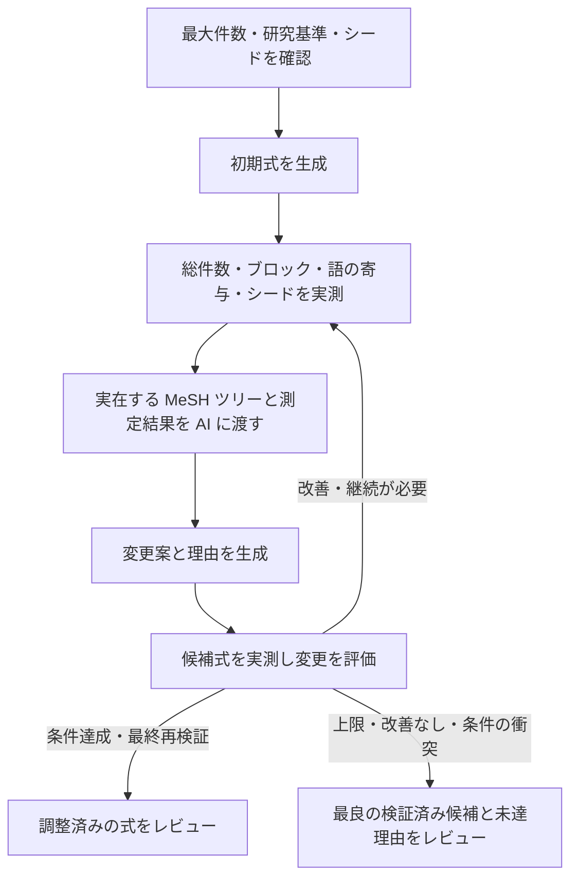

# 件数・MeSH ツリー・シード捕捉を使う検索式の自動調整案

2026-09-11。Issue [#97](https://github.com/youkiti/sr-query-builder-plugin/issues/97) に関連する設計案。調査対象は `59e1dfa`。**分割 1（保存なし生成・評価、厳密な計測、語の寄与と MeSH 文脈）は実装済み。分割 2・3 は未実装で、自動調整は画面からまだ開始できない。**

## 目指す体験

利用者が最初に PubMed の最大件数を設定する。研究基準とシードから検索式を作り、実測結果を AI に返して、MeSH の上下移動・語の追加や削除を反復する。シードが捕捉されることを実測し、調整済みの式を人のレビューへ渡す。

途中の修正ごとに採用ボタンを押させない。実行中は、現在の作業、変更理由、件数と捕捉の変化、採用されなかった試行も見られるようにする。Issue #97 の削除機能とフリーワードの整理は、この自動調整の操作として統合する。



## 開始画面

- 主入力は「PubMed の最大件数」。初期値案は現行の過大件数判定に合わせて 10,000 件。整数必須、プロジェクトごとに前回値を保持する。
- 上限は最終結合式の件数に適用する。各概念ブロックの単独件数に同じ上限を課さない。
- 組入・除外基準、承認済みブロック、検証対象シード件数を開始前に表示する。
- 開始ボタンは「検索式を作成・自動調整する」。詳細設定に反復上限を置く。初版の既定は最大5回の AI 修正案評価とする。
- シードは既存の `isSeedEligibleForValidation` に従い、PMID を重複除去する。対象数より最大件数が少ない場合は、両条件を満たせないので開始前に入力エラーを示す。
- シード0件なら登録・既存のシード候補探索へ誘導する。基準だけで生成する既存経路は利用できるが、「シード確認済みの自動調整完了」にはしない。
- 初版では現在のプロトコル・ブロック承認・シード入力を維持し、その後の `#/draft` で最大件数を設定する。

## 調整の判断

「研究基準を維持する」「既知の適格シードを失わない」を優先し、その範囲で最大件数以下を目指す。最大件数に届かない場合は未達として返す。上限だけを満たすために、プロトコルにない期間・言語・対象集団の制限や PMID 指定を追加しない。シードの include/exclude 判定も変更しない。

件数が少ないことだけで語を不要とは決めない。単独件数、ブロックでの固有寄与、最終結合式での固有寄与、シード捕捉への影響を区別する。

| 状態 | 自動調整での扱い |
|---|---|
| フリーワード単独が実測0件 | 綴り・タグ・切り詰めを AI が確認し、修正または削除を試す |
| 除去しても検索集合が変わらない | 冗長整理として削除できる。候補全体を実測して確定する |
| 固有寄与がごく小さい | 低寄与候補として AI に渡す。基準との関係と、失われる論文を確認して削除・修正・保持を選ぶ |
| 少数でもシードを拾う／必要な概念を表す | 保持または代替表現を試し、再検証する |
| 最大件数超過 | 広すぎる MeSH の下位語への置換、基準に合わない語の削除などを試す |
| シード未捕捉 | どのブロックが漏らすか測り、MeSH の上位化や同義語追加を試す |
| API エラー・未解決・数値異常 | 「不明」。0件・寄与なしとして削除しない |

低寄与の初期しきい値案は、最終式での固有寄与が「3件以下かつ全体の0.1%以下」。既存の相対1%判定をそのまま自動削除には用いない。この数値は実装時に設定可能な内部ポリシーとして持ち、実例で調整する。

低寄与候補で失われる論文が少数なら、`(変更前) NOT (変更後)` の PMID と書誌を取得し、AI に研究基準と照合させる。適格の可能性がある、または情報不足なら保持する。AI の適格性判断は推定として記録する。

シード全件捕捉は、既知の論文に対する確認であり、未知の適格研究の網羅性を意味しない。そのため、最終表示は「既知シード N/N 件捕捉」とする。既知の研究だけに偏った検索を避けるという方針は [Cochrane Handbook, Chapter 4](https://www.cochrane.org/authors/handbooks-and-manuals/handbook/current/chapter-04) にも沿う。

## 測定と AI 文脈

### 測定スナップショット

各測定を `runId`、候補ID、式の fingerprint、測定時刻に紐づける。

- 最終式の総件数と目標上限。
- ブロックごとの件数とシード捕捉一覧。結合式の AND/OR/NOT 構造を保って解釈する。
- 語の単独件数。元のフィールドタグ、NoExp、qualifier を保持したクエリを計測する。
- 低寄与・冗長候補を外したブロック式と最終式の件数、および失われるシード。
- 変更前後の差集合件数。冗長削除の主張は差集合でも確認する。任意の置換では増減両方向を分ける。
- 測定状態は成功・未測定・失敗を区別する。数値異常を0に変換しない。

既存の `analyzeFreewordDelta` はフリーワードを降順に累積 OR した増分で、MeSH と他ブロックを含む最終式から語を除いた影響とは異なる。候補の優先順位付けに再利用し、選んだ候補は変更後の式で測り直す。各語の固有寄与が0でも同時削除の根拠にはならないため、変更案全体を評価する。

全語・全ツリーノードの全組合せを毎回検索しない。初回の語別計測から候補を絞り、変更対象と関連ブロックを詳しく計測する。同一ラウンド・同一式の結果は共有し、候補確定時と最終確認時は新たに計測する。NCBI の既存レート制御とバックオフを共有する。

### MeSH ツリー

`fetchMeshTreeNumbers`、`fetchMeshLabels`、`fetchMeshChildren` を使い、現在語とシード由来語の周辺を実データで構築する。

- descriptor UI と正式ラベル、すべての tree number、親子関係。
- 現在語から上位への経路、および直下の子候補。別枝にも位置する語は枝を省略せず関連づける。
- 現在式の explode/NoExp、MajorTopic、qualifier と、包含される語。
- 対応するシードと、計測済みの件数。
- 取得失敗、未解決、子候補の件数上限による省略を明示する。

全 MeSH 語彙をプロンプトへ渡さず、最初は周辺1段を取得する。AI が追加の階層探索を要求したときは、制御側が追加取得し次の文脈へ反映する。未取得の親子関係を推測だけで適用しない。NoExp・MajorTopic・qualifier の変更は一般的な絞り込み／拡張として別に検証し、単純な内包削除と混同しない。

### AI 入出力

新しい `optimize-query` の用途を追加する。単一ブロックの `improveBlock` 呼び出しを繰り返すだけにせず、全式の構造、研究基準、最大件数、シード書誌、測定スナップショット、周辺ツリー、これまでの試行結果を一緒に渡す。

返り値は対象ブロック・変更前後の式・追加／削除／置換した語・変更理由・参照した測定／ノードID・追加情報の要求とする。AI が書いた予想件数は実測値として扱わない。

初版は1回に1ブロックを中心とする変更案を評価し、因果を追えるようにする。ブロックID、承認済み結合構造、研究デザインフィルタの保護を機械的に検証する。研究基準との意味的整合性は AI の検討結果として明示し、機械的に保証できた項目と分ける。

## 反復と停止

1. 入力を固定し、初期式とその測定を作る。
2. 初期式が目標内でも、少なくとも1回は冗長・低寄与とシード漏れを分析し、AI の修正要否判断を行う。
3. AI の候補を構文・参照・許された操作の範囲で検査し、実測する。
4. 捕捉済みシードを失う候補を却下する。初期式に未捕捉がある間は、捕捉済み集合を維持しながら漏れを減らす案を優先する。
5. シード全件捕捉後は、それを維持して上限を目指す。上限到達後はさらに件数を小さくすること自体を目的にしない。
6. 却下した候補も、理由と実測結果を次の AI 入力に渡す。同一の失敗を繰り返さない。
7. 完了候補をキャッシュに依存せず再検証する。総件数、シード全件捕捉、式の整合性が揃って初めて「条件達成」とする。

最大5回、同一式への回帰、2回連続で改善なし、ユーザー停止、継続不能な API エラーで終了する。全件捕捉と上限を両立できなければ「要確認」とし、最良の検証済み候補と未達理由を返す。シードを維持した候補を、上限だけを満たしてシードを失った候補より優先する。

時間・API 呼び出しにも有限の予算を持たせ、次の処理前に確認する。停止・上限到達後は新規呼び出しを始めず、遅れて戻った応答で式を変更しない。通信の即時中断には現在ない AbortSignal の配線が必要なので、まず境界での停止と結果の破棄を確実にする。

## 進捗 UI

画面上部は常時「最大件数」「現在の最良候補の件数」「既知シード捕捉数」「反復回数」「経過時間」を表示する。試行中の件数と最良候補の件数は混ぜない。概算 AI 費用は取得できた場合だけ表示する。

段階は「初期式作成 → 実測 → 調整 → 再検証 → レビュー」。反復回数が可変なので、全体に根拠のない完了率を付けない。固定作業だけ「語別件数 18/24語」「シード確認 8/8件」と表示する。

以下は画面の説明用の架空例であり、実測結果ではない。

```text
検索式を自動調整しています                 試行4 / 最大5回   経過 03:24
目標 5,000件以下     最良候補 7,240件     既知シード 8/8件

完了 初期式作成 → 完了 実測 → 実行中 調整 → 待機 最終確認
現在：疾患ブロックの MeSH を下位語へ置き換えた影響を確認中

初期式     18,420件    シード 7/8件
試行1      20,100件    シード 8/8件   採用：漏れたシードの同義語を追加
試行2       4,120件    シード 7/8件   却下：シード1件を失う
試行3       7,240件    シード 8/8件   採用：基準外の広い語を置換

[変更の詳細を見る] [現在の候補を見る] [停止して候補を確認]
```

初版は1反復1候補として「試行回数」へ統一する。取得処理の通信リトライは別に表示し、AI の修正案を評価した試行数には数えない。

変更詳細には、次を表示する。

- MeSH：`上位語 → 下位語` のツリー上の差分、根拠、前後件数。
- フリーワード：削除・追加・修正した語、単独件数と最終式での固有寄与、基準との関係。
- シード：どのシードを回収したか／失ったために戻したか。書誌へのリンク。
- API 待機：レート調整中、再試行中、取得失敗を別表示する。
- 説明は実行イベントと測定事実、および短い変更理由から構築する。

最終画面は「条件達成」「要確認」「停止」「エラー」を区別し、最終式、上限への到達状況、既知シード N/N、変更一覧、残った懸念、試行履歴をまとめる。「採用して保存」「編集して確認」を用意する。毎回の内部試行を人に承認させるフローにはしない。

アクセシビリティは、更新を `aria-live` で必要な粒度だけ伝え、進捗更新でフォーカスを移動させない。履歴の自動スクロールは利用者が過去の試行を読んでいる間は止める。

## 状態・保存・既存コードへの接続

現在の `generateDraft` は生成途中の流れの最後で FormulaVersion を保存し、`currentFormulaMarkdown` を更新する。一方 `runValidation` は保存済み式を読み、毎回 Sheets/Drive にログを書く。この2関数をそのまま反復すると、未確定の候補が正式版として扱われる。

次の分離を先に行う。

| 担当 | 実装案 |
|---|---|
| 初期式 | `draftService` から保存を伴わない生成処理を抽出する。既存の公開関数は生成＋保存のラッパとして残せる |
| 評価 | 式と固定シードを引数に取る保存なしの評価サービスを追加。`checkSearchLines`／`checkFinalQuery` と厳密な ESearch を再利用する |
| 文脈 | 検証・編集画面で共有する語抽出、固有寄与、周辺 MeSH の取得処理を views の外へ置く |
| AI | `optimizeQuery.ts` と専用の入出力スキーマ。`LlmPurpose` に用途を追加する |
| 反復制御 | `queryOptimizationService.ts` で候補、採用判定、停止、測定予算、イベントを管理する |
| 画面 | `draftView.ts`、`store.ts`、`bootstrap.ts` に設定・進捗・レビューを接続する |
| 記録 | run ごとに初期式、候補、測定、変更理由、採否、目標、シード／基準のスナップショットを保存する |
| 確定 | 人の採用時に `createdBy: 'auto_optimize'` の版を保存し、親版・最終検証・実行ログを関連づける。この enum は既に存在する |

未確定の候補は専用 run 状態に置く。実行中のプロジェクト切替・手編集・複数タブからの同時操作では run の世代と所有権を確認し、古い結果を適用しない。保存は run ごとに一度だけ行えるようにする。

長時間処理なので、各評価完了時に `chrome.storage.local` へチェックポイントを残す。タブ閉鎖・リロード後は「中断」として復元し、明示的な再開で固定入力と現プロジェクトの整合性を確認する。バックグラウンドで処理が継続していたようには表示しない。ログを復元しただけでは再検証済みとはせず、再開時に必要な値を測り直す。

既存の過大ヒット時フィルタ提案は、通常生成経路では維持し、自動調整経路では同じ結果に対して二重実行しない。`designSpecificQuery` はシード候補探索用の強い絞り込みなので、自動調整用にはそのまま流用しない。

## 実装の分割と受け入れ条件

1. 保存なし生成・評価、厳密な計測、語の寄与と MeSH 文脈。既存の生成／保存を回帰確認する。
2. AI 修正と反復制御。上限・シード捕捉・改善判定・巻き戻し・停止・チェックポイントをテストする。
3. 開始設定、ライブ履歴、ツリー差分、最終レビュー、採用保存。文書更新と E2E 全体を通す。

各分割では既存経路を動作可能に保ち、3まで揃ってから新しい自動調整を通常の開始操作として公開する。#97 の機械的な冗長削除は1・2に含め、削除ボタンを完成させてから自動化に着手する順番にはしない。

- 最大件数が UI → AI 入力 → 終了判定 → 履歴まで同じ値で使われる。
- 件数・ツリー・シード漏れの実測結果を受けて、AI が少なくとも一度は初期式を再評価する。
- フリーワードのゼロ／低寄与、MeSH の上位化／下位化を試し、前後を実測する。
- 低寄与の語がシードを拾う場合に機械的に削除しない。複数同時削除も案全体で検証する。
- 捕捉済みシードを失う候補を却下し、却下理由を次の AI 入力に渡す。
- 上限と捕捉を両立できなければ未達として停止し、最良の検証済み候補を提示する。
- エラー・未測定を0件としない。失敗候補、表示中の候補、採用候補の数値が混ざらない。
- 停止／リロード／プロジェクト切替／重複応答で未確定式が正式版を上書きしない。
- 実行中の状態・結果・履歴が再描画で失われず、最終レビューまで各試行の理由を追える。
- 通常の lint、型チェック、単体テスト、dev ビルド、E2E 全体を通す。

分割 1 は実装済み。`generateDraftFormula`（保存なし生成）、`queryEvaluationService`（保存なし評価。測定失敗を実測 0 件と区別する）、`EutilsDeps.strictCounts`（件数の欠落・不正値を恒久エラーにする厳密な ESearch）、`blockTerms` / `meshContext`（語抽出・寄与・周辺 MeSH をビュー層の外へ）を追加した。既存の `generateDraft` / `runValidation` の挙動は変えていない。

分割 2・3（AI 反復制御と画面接続）は未実装で、上記の新しい反復動作はまだ検証されていない。分割 1 の追加分は単体テストで固定してあるが、`queryEvaluationService` を呼ぶ画面がまだ無いため、厳密な計測の挙動は手動確認の対象にできない。
