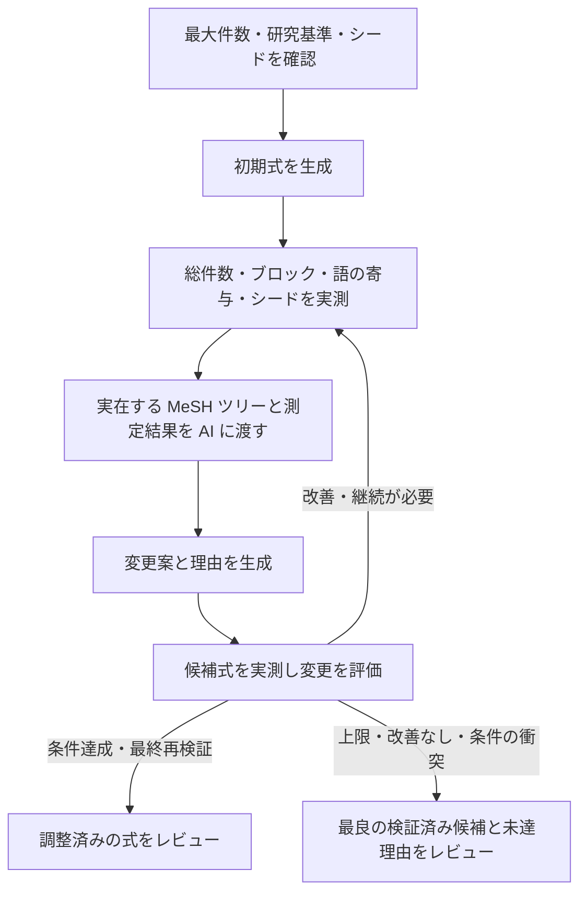

# 件数・MeSH ツリー・シード捕捉を使う検索式の自動調整案

2026-09-11。Issue [#97](https://github.com/youkiti/sr-query-builder-plugin/issues/97) に関連する設計案。調査対象は `59e1dfa`。**分割 1〜3 は実装済み。`#/draft` で開始設定・実行・ライブ履歴・最終レビュー・採用保存を利用できる。E2E の追加シナリオは実装済みで、実ブラウザでの実行確認は別途必要。**

## 目指す体験

利用者が最初に PubMed の最大件数を設定する。研究基準とシードから検索式を作り、実測結果を AI に返して、MeSH の上下移動・語の追加や削除を反復する。シードが捕捉されることを実測し、調整済みの式を人のレビューへ渡す。

途中の修正ごとに採用ボタンを押させない。実行中は、現在の作業、変更理由、件数と捕捉の変化、採用されなかった試行も見られるようにする。Issue #97 の削除機能とフリーワードの整理は、この自動調整の操作として統合する。



## 開始画面

- 主入力は「PubMed の最大件数」。初期値は 2,000 件（自動調整専用。過大ヒット時フィルタ提案の 10,000 件とは別）。整数必須、プロジェクトごとに前回値を保持する。
- 上限は最終結合式の件数に適用する。各概念ブロックの単独件数に同じ上限を課さない。
- 組入・除外基準、承認済みブロック、検証対象シード件数を開始前に表示する。
- 開始ボタンは「検索式を作成・自動調整する」。詳細設定に反復上限を置く。初版の既定は最大5回の AI 修正案評価とする。
- シードは既存の `isSeedEligibleForValidation` に従い、PMID を重複除去する。対象数より最大件数が少ない場合は、両条件を満たせないので開始前に入力エラーを示す。
- シード0件なら登録・既存のシード候補探索へ誘導する。基準だけで生成する既存経路は利用できるが、「シード確認済みの自動調整完了」にはしない。
- 初版では現在のプロトコル・ブロック承認・シード入力を維持し、その後の `#/draft` で最大件数を設定する。

## 調整の判断

最終レビューは「既知文献の捕捉 / 件数目標 / 外側の確認 / 削除影響の確認」の 4 区分で、確認済み・未達・判定待ち・未確認を文字で示し、未確認事項を列挙する。同じ算出結果をチェックポイントの終了記録と採用保存の Drive 実行ログへ保存する。

条件達成または要確認で終了したら、最良候補の式に対して margin（拡張式 NOT 現式）探索を自動実行する。これは自動調整の通信予算 200 回とは別枠である。停止・取得失敗でも自動調整本体の終了状態は変えず、外側の確認を未確認として残す。候補は出版年代・用語・介入（曝露）の多様性を意識して選ぶ。

外側の境界事例と、保留候補で失う文献を人が include / exclude / maybe と判定し、SeedPapers に source=interactive で記録する。maybe / exclude を include に格上げせず、AI の理由で人の判定を代替しない。保存済み include があれば、その文献を保護して同じ最大件数・反復上限で再調整できる。開始式は最良候補、シードは再取得し、新しい run として実行する。再調整は現在の最終候補を保存しないため、残す場合は先に「採用して保存」を行う。失う集合の先頭 K 件を判定しても、全体 L 件の残り L−K 件は未確認と表示し続ける。

相対目標（初期式の実測件数に対する比率で上限を決める案）は未実装で、評価ハーネスで同一初期式の対比較ができるようになってから判断する。

未捕捉シードがある間は、全ブロックのシード × ブロック捕捉表と未捕捉書誌（抄録・MeSH を含む）を AI に渡す。
削除案は測定前に却下し、同義語追加・MeSH 拡張による回収を優先する。説明された置換は実測する。
承認外ブロック・結合構造が落としているシードは語の調整では回収できないと診断する。
最終レビューに診断とブロック承認（#/blocks）へ戻る導線を出し、検索概念・フィルタの見直しを促す。

採用判定を通った候補だけ、変更前 NOT 変更後（失う集合）と逆方向（増える集合）を実測する。
失う集合が 1 件でもある候補、または差集合の実測に失敗した候補は自動採用せず、レビュー候補として保留する。
保留は改善なしとして数え、最良式は更新しない。失う集合 0 件を実測できた候補だけ従来の採用経路へ進む。
失う集合の先頭最大 20 件の書誌を確認用に提示するが、集合全体の安全性の根拠や AI による採否判定には使わない。

「研究基準を維持する」「既知の適格シードを失わない」を優先し、その範囲で最大件数以下を目指す。最大件数に届かない場合は未達として返す。上限だけを満たすために、プロトコルにない期間・言語・対象集団の制限や PMID 指定を追加しない。シードの include/exclude 判定も変更しない。

件数が少ないことだけで語を不要とは決めない。単独件数、ブロックでの固有寄与、最終結合式での固有寄与、シード捕捉への影響を区別する。

| 状態 | 自動調整での扱い |
|---|---|
| フリーワード単独が実測0件 | 綴り・タグ・切り詰めを AI が確認し、修正または削除を試す |
| 除去しても検索集合が変わらない | 冗長整理として削除できる。候補全体を実測して確定する |
| 固有寄与がごく小さい | 低寄与候補として AI に渡す。基準との関係と、失われる論文を確認して削除・修正・保持を選ぶ |
| 少数でもシードを拾う／必要な概念を表す | 保持または代替表現を試し、再検証する |
| 最大件数超過 | 広すぎる MeSH の下位語への置換、基準に合わない語の削除などを試す |
| シード未捕捉 | どのブロックが漏らすか測り、MeSH の上位化や同義語追加を試す |
| API エラー・未解決・数値異常 | 「不明」。0件・寄与なしとして削除しない |

低寄与の初期しきい値案は、最終式での固有寄与が「3件以下かつ全体の0.1%以下」。既存の相対1%判定をそのまま自動削除には用いない。この数値は実装時に設定可能な内部ポリシーとして持ち、実例で調整する。

失う集合の書誌は人の確認用に提示するだけで、AI に適格性を照合させて採否を決めることはしない。少数の固有文献こそ重要なことがあり、AI の除外推定を安全証明にしないため。AI による照合を補助として足すかどうかは、実 API の評価で保留が過剰になることが確かめられてから検討する。

シード全件捕捉は、既知の論文に対する確認であり、未知の適格研究の網羅性を意味しない。そのため、最終表示は「既知シード N/N 件捕捉」とする。既知の研究だけに偏った検索を避けるという方針は [Cochrane Handbook, Chapter 4](https://www.cochrane.org/authors/handbooks-and-manuals/handbook/current/chapter-04) にも沿う。

## 測定と AI 文脈

### 測定スナップショット

各測定を `runId`、候補ID、式の fingerprint、測定時刻に紐づける。

- 最終式の総件数と目標上限。
- ブロックごとの件数とシード捕捉一覧。結合式の AND/OR/NOT 構造を保って解釈する。
- 語の単独件数。元のフィールドタグ、NoExp、qualifier を保持したクエリを計測する。
- 低寄与・冗長候補を外したブロック式と最終式の件数、および失われるシード。
- 変更前後の差集合件数。冗長削除の主張は差集合でも確認する。任意の置換では増減両方向を分ける。
- 測定状態は成功・未測定・失敗を区別する。数値異常を0に変換しない。

既存の `analyzeFreewordDelta` はフリーワードを降順に累積 OR した増分で、MeSH と他ブロックを含む最終式から語を除いた影響とは異なる。候補の優先順位付けに再利用し、選んだ候補は変更後の式で測り直す。各語の固有寄与が0でも同時削除の根拠にはならないため、変更案全体を評価する。

全語・全ツリーノードの全組合せを毎回検索しない。初回の語別計測から候補を絞り、変更対象と関連ブロックを詳しく計測する。同一ラウンド・同一式の結果は共有し、候補確定時と最終確認時は新たに計測する。NCBI の既存レート制御とバックオフを共有する。

### MeSH ツリー

`fetchMeshTreeNumbers`、`fetchMeshLabels`、`fetchMeshChildren` を使い、現在語とシード由来語の周辺を実データで構築する。

- descriptor UI と正式ラベル、すべての tree number、親子関係。
- 現在語から上位への経路、および直下の子候補。別枝にも位置する語は枝を省略せず関連づける。
- 現在式の explode/NoExp、MajorTopic、qualifier と、包含される語。
- 対応するシードと、計測済みの件数。
- 取得失敗、未解決、子候補の件数上限による省略を明示する。

全 MeSH 語彙をプロンプトへ渡さず、最初は周辺1段を取得する。AI が追加の階層探索を要求したときは、制御側が追加取得し次の文脈へ反映する。未取得の親子関係を推測だけで適用しない。NoExp・MajorTopic・qualifier の変更は一般的な絞り込み／拡張として別に検証し、単純な内包削除と混同しない。

### AI 入出力

新しい `optimize-query` の用途を追加する。単一ブロックの `improveBlock` 呼び出しを繰り返すだけにせず、全式の構造、研究基準、最大件数、シード書誌、測定スナップショット、周辺ツリー、これまでの試行結果を一緒に渡す。

返り値は対象ブロック・変更前後の式・追加／削除／置換した語・変更理由・参照した測定／ノードID・追加情報の要求とする。AI が書いた予想件数は実測値として扱わない。

初版は1回に1ブロックを中心とする変更案を評価し、因果を追えるようにする。ブロックID、承認済み結合構造、研究デザインフィルタの保護を機械的に検証する。研究基準との意味的整合性は AI の検討結果として明示し、機械的に保証できた項目と分ける。

## 反復と停止

1. 入力を固定し、初期式とその測定を作る。
2. 初期式が目標内でも、少なくとも1回は冗長・低寄与とシード漏れを分析し、AI の修正要否判断を行う。情報要求の回は最終再検証へ進まず、次の AI 呼び出しへ取得結果を渡す。情報要求も反復上限を消費する。
3. AI の候補を構文・参照・許された操作の範囲で検査し、実測する。
4. 捕捉済みシードを失う候補を却下する。初期式に未捕捉がある間は、捕捉済み集合を維持しながら漏れを減らす案を優先する。
5. シード全件捕捉後は、それを維持して上限を目指す。上限到達後はさらに件数を小さくすること自体を目的にしない。
6. 却下した候補も、理由と実測結果を次の AI 入力に渡す。同一の失敗を繰り返さない。
7. 完了候補をキャッシュに依存せず再検証する。総件数、シード全件捕捉、式の整合性が揃って初めて「条件達成」とする。最後の情報要求後に候補評価が来ないまま停止・予算・反復上限などで終了した場合、要求元の試行 ID と文脈へ反映できた件数／要求件数を判断未了の理由として残す。採用・却下・同一式回帰のいずれでも、候補評価の回が来れば判断済みとする。

最大5回、同一式への回帰、2回連続で改善なし、ユーザー停止、継続不能な API エラーで終了する。全件捕捉と上限を両立できなければ「要確認」とし、最良の検証済み候補と未達理由を返す。シードを維持した候補を、上限だけを満たしてシードを失った候補より優先する。

時間・API 呼び出しにも有限の予算を持たせ、次の処理前に確認する。停止・上限到達後は新規呼び出しを始めず、遅れて戻った応答で式を変更しない。通信の即時中断には現在ない AbortSignal の配線が必要なので、まず境界での停止と結果の破棄を確実にする。

## 進捗 UI

画面上部は常時「最大件数」「現在の最良候補の件数」「既知シード捕捉数」「試行回数」「情報取得」「経過時間」を表示する。試行中の件数と最良候補の件数は混ぜない。概算 AI 費用は取得できた場合だけ表示する。

段階は「初期式作成 → 実測 → 調整 → 再検証 → 外側の確認 → レビュー」。反復回数が可変なので、全体に根拠のない完了率を付けない。固定作業だけ「語別件数 18/24語」「シード確認 8/8件」と表示する。

以下は画面の説明用の架空例であり、実測結果ではない。

```text
検索式を自動調整しています                 試行4 / 最大5回   経過 03:24
目標 5,000件以下     最良候補 7,240件     既知シード 8/8件

完了 初期式作成 → 完了 実測 → 実行中 調整 → 待機 最終確認
現在：疾患ブロックの MeSH を下位語へ置き換えた影響を確認中

初期式     18,420件    シード 7/8件
試行1      20,100件    シード 8/8件   採用：漏れたシードの同義語を追加
試行2       4,120件    シード 7/8件   却下：シード1件を失う
試行3       7,240件    シード 8/8件   採用：基準外の広い語を置換

[変更の詳細を見る] [現在の候補を見る] [停止して候補を確認]
```

「試行回数」は候補評価だけを数え、「情報取得」は情報要求の回数を別に表示する。取得処理の通信リトライはいずれにも数えない。情報取得回数は表示用で、永続化する予算（通信回数・経過時間・評価試行数）は変更しない。履歴は情報要求とその文脈を読んだ次の判断を別の行にし、情報要求には反映件数／要求件数、判断には元の情報要求の試行 ID と件数を残す。情報要求が続いた場合、判断は最後の情報要求に対応付ける。

変更詳細には、次を表示する。

- MeSH：`上位語 → 下位語` のツリー上の差分、根拠、前後件数。
- フリーワード：削除・追加・修正した語、単独件数と最終式での固有寄与、基準との関係。
- シード：どのシードを回収したか／失ったために戻したか。書誌へのリンク。
- API 待機：レート調整中、再試行中、取得失敗を別表示する。
- 説明は実行イベントと測定事実、および短い変更理由から構築する。

最終画面は「条件達成」「要確認」「停止」「エラー」を区別し、最終式、上限への到達状況、既知シード N/N、変更一覧、残った懸念、試行履歴をまとめる。「採用して保存」「編集して確認」を用意する。毎回の内部試行を人に承認させるフローにはしない。

アクセシビリティは、更新を `aria-live` で必要な粒度だけ伝え、進捗更新でフォーカスを移動させない。履歴の自動スクロールは利用者が過去の試行を読んでいる間は止める。

## 状態・保存・既存コードへの接続

現在の `generateDraft` は生成途中の流れの最後で FormulaVersion を保存し、`currentFormulaMarkdown` を更新する。一方 `runValidation` は保存済み式を読み、毎回 Sheets/Drive にログを書く。この2関数をそのまま反復すると、未確定の候補が正式版として扱われる。

次の責務に分離している。

| 担当 | 実装 |
|---|---|
| 初期式 | `draftService` から保存を伴わない生成処理を抽出する。既存の公開関数は生成＋保存のラッパとして残せる |
| 評価 | 式と固定シードを引数に取る保存なしの評価サービスを追加。`checkSearchLines`／`checkFinalQuery` と厳密な ESearch を再利用する |
| 文脈 | 検証・編集画面で共有する語抽出、固有寄与、周辺 MeSH の取得処理を views の外へ置く |
| AI | `optimizeQuery.ts` と専用の入出力スキーマ。`LlmPurpose` に用途を追加する |
| 反復制御 | `queryOptimizationService.ts` で候補、採用判定、停止、測定予算、イベントを管理する |
| 画面 | `draftView.ts`、`store.ts`、`bootstrap.ts` に設定・進捗・レビューを接続する |
| 記録 | run ごとに初期式、候補、測定、変更理由、採否、目標、シード／基準のスナップショットを保存する |
| 確定 | 人の採用時に `createdBy: 'auto_optimize'` の版を保存し、親版・最終検証・実行ログを関連づける。この enum は既に存在する |

未確定の候補は専用 run 状態に置く。実行中のプロジェクト切替・手編集・複数タブからの同時操作では run の世代と所有権を確認し、古い結果を適用しない。保存は run ごとに一度だけ行えるようにする。

長時間処理なので、各評価完了時と終了時に `chrome.storage.local` へチェックポイントを残す。初回評価後と再開時の通信前の途中保存は、前回保存から10通信ごとに行う（これから送る1回を含む）。保存回数と直列化・待機の負担を減らしつつ、中断時に払い戻されうる未記録の通信を最大9回に抑える。消費を多めに見積もることはせず、保存する通信数は累積消費と送信予定の1回分だけとする。評価境界の間には最大100通信の語別計測が入るため、評価境界だけの保存では払い戻しが大きすぎる。評価完了時と終了時の保存は間引かず、途中保存の基準も評価完了時の通信数へ更新する。タブ閉鎖・リロード後は終了記録の有無に応じて「中断」または「完了済み」のログを復元する。中断記録に最良候補・入力指標・残予算がある場合にだけ、利用者の操作で最良候補を初期式とする新しい `runId` の実行を始める。件数・シード捕捉・語別計測はすべて測り直し、過去の却下式・理由・fingerprint は未再検証の AI 文脈としてだけ引き継ぐ。同一式への回帰停止の集合には過去の fingerprint を入れない。通信回数・経過時間・評価試行数の累積消費量を元の上限から差し引き、いずれかの残予算がゼロ以下なら再開を提示しない。経過時間は実行中に保存した値を累積し、タブを閉じていた時間は含めない。研究基準・承認ブロックの内容と結合設定・シード PMID 集合・最大件数の正規化した入力指標が一致しなければ、理由を示して新規実行を促す。現在式の手編集は入力指標に含めない。旧形式の情報不足の記録はログ表示に留める。チェックポイントの保存は最新キー1本とする。復元したログは state に保持するため、再開した run が最新キーを更新しても、最初の試行が届くまでは画面で読める。バックグラウンドで処理が継続していたようには表示せず、測り直すことと残予算を明示する。ログを復元しただけでは再検証済みとせず、復元ログからの採用保存は行わない。

既存の過大ヒット時フィルタ提案は、通常生成経路では維持し、自動調整経路では同じ結果に対して二重実行しない。`designSpecificQuery` はシード候補探索用の強い絞り込みなので、自動調整用にはそのまま流用しない。

## 実装の分割と受け入れ条件

1. 保存なし生成・評価、厳密な計測、語の寄与と MeSH 文脈。既存の生成／保存を回帰確認する。
2. AI 修正と反復制御。上限・シード捕捉・改善判定・巻き戻し・停止・チェックポイントをテストする。
3. 開始設定、ライブ履歴、ツリー差分、最終レビュー、採用保存。文書更新と E2E 全体を通す。

通常の生成・検証経路を維持し、同じ `#/draft` に自動調整の開始操作を追加した。冗長削除も反復中の候補評価として扱う。

- 最大件数が UI → AI 入力 → 終了判定 → 履歴まで同じ値で使われる。
- 件数・ツリー・シード漏れの実測結果を受けて、AI が少なくとも一度は初期式を再評価する。
- フリーワードのゼロ／低寄与、MeSH の上位化／下位化を試し、前後を実測する。
- 低寄与の語がシードを拾う場合に機械的に削除しない。複数同時削除も案全体で検証する。
- 捕捉済みシードを失う候補を却下し、却下理由を次の AI 入力に渡す。
- 上限と捕捉を両立できなければ未達として停止し、最良の検証済み候補を提示する。
- エラー・未測定を0件としない。失敗候補、表示中の候補、採用候補の数値が混ざらない。
- 停止／リロード／プロジェクト切替／重複応答で未確定式が正式版を上書きしない。
- 実行中の状態・結果・履歴が再描画で失われず、最終レビューまで各試行の理由を追える。
- 通常の lint、型チェック、単体テスト、dev ビルド、E2E 全体を通す。

分割 1 は実装済み。`generateDraftFormula`（保存なし生成）、`queryEvaluationService`（保存なし評価。測定失敗を実測 0 件と区別する）、`EutilsDeps.strictCounts`（件数の欠落・不正値を恒久エラーにする厳密な ESearch）、`blockTerms` / `meshContext`（語抽出・寄与・周辺 MeSH をビュー層の外へ）を追加した。既存の `generateDraft` / `runValidation` の挙動は変えていない。

分割 2 は `queryOptimizationService` と `optimizeQuery` により、AI 修正・実測・採否・停止・最終再検証を実装した。分割 3 は開始設定、固定指標、ライブ履歴と変更詳細、チェックポイントのログ復元、最終レビューを接続した。現在は情報取得回数を含む 6 指標を表示する。最終レビューは「条件達成」「要確認」「停止」「エラー」を区別し、「既知シード N/N 件捕捉」と網羅性を保証しない旨を表示する。

採用時だけ `queryOptimizationAdoptionService` が `auto_optimize` の版を保存する。現在の版を親とし、プロトコルの版・スナップショットを引き継ぐ。run ID を採用版と最終検証ログの ID に使い、Drive の実行ログ（固定した基準・ブロック・シード、最終候補の検証、全試行、MeSH 文脈）を版のメモと検証ログから参照する。保存中・保存済みの再保存を拒否し、応答喪失後の再試行は既存行を照会する。採用後も実行結果と試行履歴を保持する。「編集して確認」は保存せず `formulaEditDraft` に式と由来（プロジェクト・run ID・モデル）を載せて `#/edit` へ移る。保存版がない場合もメモ・AI 指示・提案の手編集を保持し、AI 改善を使える。その後の保存は `user_edit` とし、メモに run ID、モデル欄に自動調整時のモデルを引き継ぐ。

開始設定の値が不正な場合と最大件数がシード数を下回る場合は、設定欄にエラーを表示し、新しい最終レビューを作らない。進捗通知は通常 100ms ごとにまとめ、段階遷移と試行確定は即時反映する。経過時間のタイマーは再描画前に解除する。

画面からの語別詳細計測は有効だが、run 全体で追加 HTTP を 100 回までに制限する。最初に承認ブロックの全フリーワード・MeSH 語の最終式での固有寄与を測り、その後に単独件数・累積 OR の純増（Δ）を測る。各段階ではブロック実測件数の降順（未測定は最後、同数・未測定どうしは元の順）で測定する。固有寄与はブロック ID と語で一時保持し、出力は従来のブロック順、各ブロックのフリーワード行（個別件数降順）→ MeSH 行を保つ。OR だけのブロックで該当セグメントを自己差集合に置き換えて除去後の式を作り、固有寄与が最終式の実測件数以下の場合だけ採用する。個別件数の成否にかかわらず全語を対象とし、測れない値は null のままにする。部分失敗・クランプによる不確かな Δ も未測定として扱う。単独件数・累積 OR・MeSH はクエリをキーとして run 内で再利用し、固有寄与は最終式全体を含むクエリで区別する。最良式に terms がある間は反復で測り直さない。

語別計測にはグローバル予算側の確保も適用する。初期式の実測前後の通信数の差を C として、確保分は min(2C + 3 + 2, floor(maxApiCalls / 2)) とする。2C は次候補の実測と最終再検証、3 は差集合の esearch 2回と efetch 1回、追加の2は AI 提案1回と上限到達時に応答を破棄する境界の余裕1回。確保分の上限を全体の半分にして、ブロック数が多い式でも語別計測へ予算を残す。キャッシュにないクエリの取得前と実際の HTTP 送信直前に、残予算が確保分以下なら語別計測だけを打ち切り、候補評価を続ける。100通信の語別上限と、候補評価・再検証のための予算確保は別の未達理由で表示する。この確保は次候補1回を目安とし、全反復・追加情報要求・将来のリトライまで保証するものではない。初期実測などですでに残予算が少ない場合や半分の上限が適用された場合は、語別計測が0回、または候補評価が予算切れになることもある。

追加 E2E は設定から条件達成までの通し、シードなしの要確認、採用版・親版・一度だけの保存、保存なしの編集導線、進捗と最終レビューそれぞれの axe 検査を扱う。実 API への検証は行わず、実ブラウザでの E2E 実行結果は別途確認する。
