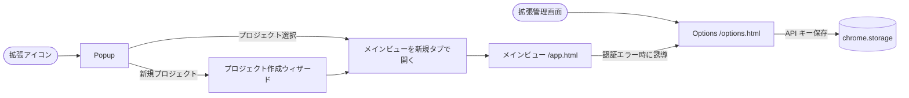
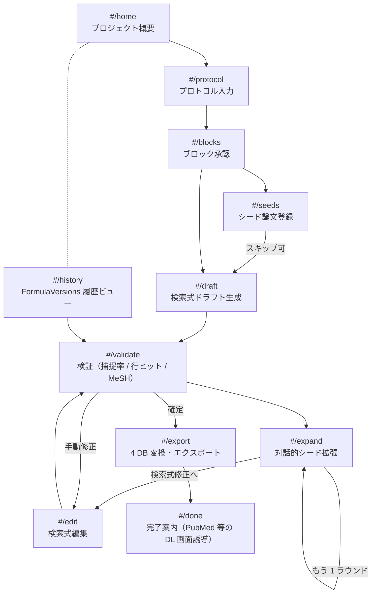

# UI 画面遷移図モック（v0.1）

- **作成日**: 2026-04-17
- **対象**: sr-query-builder-plugin の Chrome 拡張内ルーティング
- **位置づけ**: [requirements.md §11.3](requirements.md) で参照する画面遷移モック。実装フェーズで詳細レイアウトを詰める

## 1. 起動経路と全体ルーティング

Chrome 拡張は 3 つのエントリポイントを持つ：

| エントリ | 役割 | 実装 |
|---|---|---|
| Popup | プロジェクト選択 + 「メインビューを開く」ボタン。最近のプロジェクト一覧と新規作成 | `popup.html`（拡張アイコンクリック） |
| メインビュー | フルページの作業画面。本拡張の作業はほぼここで完結 | `app.html`（`chrome.tabs.create` で開く） |
| Options | API キー設定、既定 LLM プロバイダ、Cochrane フィルタ版選択 | `options.html`（拡張管理画面から開く） |

## 2. メインビュー内ルーティング

メインビューはシングルページアプリ。左サイドバーのステップナビと右ペインの作業エリアで構成。ハッシュルーティング（`#/protocol` 等）で各ステップへ遷移する。

### 各画面の責務

| ハッシュ | 画面名 | 主な操作 | 主要 Sheets タブ |
|---|---|---|---|
| `#/home` | プロジェクト概要 | プロジェクト名・現在の Protocol version・最新 Formula version の表示。各ステップへ移動 | `Meta` / `Protocol` / `FormulaVersions` |
| `#/protocol` | プロトコル入力 | 手入力 / `.md` / `.docx` の 3 タブ。フォーム送信で `extract-protocol` skill を呼ぶ | `Protocol` 追記 |
| `#/blocks` | ブロック承認 | LLM 抽出ブロックの編集（[docs/ui-block-approval.md](ui-block-approval.md) 参照） | `ProtocolBlocks` 追記 |
| `#/seeds` | シード論文登録 | PMID 直接入力 / NBIB / RIS の 3 タブ。ingest サマリ表示 | `SeedPapers` 追記 |
| `#/draft` | 検索式ドラフト生成 | 4 skill を順次実行する進捗ビュー（block-designer → mesh-suggester → freeword-designer → filter-designer） | `FormulaVersions`（`ai_draft`）, `LLMApiLog` |
| `#/validate` | 検証 | 行ごとヒット数バッジ、シード捕捉率サマリ、MeSH ダイアグラム（Mermaid）、ブロック重複（P1） | `ValidationLog` |
| `#/expand` | 対話的シード拡張（margin 探索・**dev**） | 現式を 2 軸で拡張 → 外側（拡張式 NOT 現式）を検索 → 境界事例提示 → include/exclude/maybe 判定 → 再検証＋更新提案 | `SeedPapers`（`source=interactive`）, 自動再検証 |
| `#/edit` | 検索式編集 | ブロックカード一覧（textarea は廃止）。ホバーの鉛筆ボタンで各ブロックをインライン手編集／「AI に改善させる」で指示文入力＋文脈開示（RQ・ブロック定義・シード論文・直近検証の捕捉率/取りこぼし）→ improve-block skill 実行 → diff → accept/reject | `FormulaVersions`（`user_edit` / `auto_optimize`） |
| `#/export` | 4 DB 変換 | ワンクリックで CENTRAL / Embase / CT.gov / ICTRP に変換、`.md` ダウンロード | `Conversions` |
| `#/done` | 完了案内 | PubMed 検索ページを新規タブで開くリンク、CT.gov / ICTRP リンク、nbib ダウンロード手順 | （読み取りのみ） |
| `#/history` | バージョン履歴 | `FormulaVersions` 一覧。各バージョンの protocol_version / capture_rate / 作成種別を表示。クリックで `#/validate` に該当 version を読み込む | `FormulaVersions` / `ValidationLog` |

## 3. 状態遷移とガード条件

各ステップへの遷移には前提条件があり、サイドバーで未充足ステップはディム表示にする：

| 遷移 | ガード | 未充足時の挙動 |
|---|---|---|
| `→ #/blocks` | `Protocol` に少なくとも 1 行存在 | サイドバーでディム、クリック時はトーストで誘導 |
| `→ #/draft` | `ProtocolBlocks` が承認済み（`block_count >= 1`） | 同上 |
| `→ #/validate` | `FormulaVersions` に少なくとも 1 行存在 | 同上 |
| `→ #/expand` | 検索式（`FormulaVersions` / `currentFormulaVersionId`）が存在 | 「先に /draft で検索式を生成してください」（MVP 実装は formula 有無で近似） |
| `→ #/export` | 検証済みの `version_id` が選択されている | 「エクスポート対象 version を選択してください」 |

## 4. グローバル UI 要素

すべての画面に共通：

- **左サイドバー**: ステップナビ（Home → Protocol → Blocks → Seeds → Draft → Validate → Expand → Edit → Export）。現在地ハイライト、未充足ステップはディム
- **トップバー**:
  - アプリタイトル（"SR Query Builder"）をクリックで `#/home`（プロジェクト概要）に戻る。そこから「別のプロジェクトを開く」ボタンで Popup を新規タブで起動できる。Chrome 拡張仕様上、Popup を直接再表示することはできないため二段遷移としている
  - 現在のプロジェクト名は右上の status ラベル（`ROUTE_LABELS[route] / projectName`）に含めて表示する
  - 現在の `Protocol.version` と `FormulaVersions.version_id`（短縮表示）
  - LLM プロバイダ + 累積コスト（`LLMApiLog.cost_estimate_usd` の合計）
  - ヘルプアイコン
- **右下フローティング**: 直近の `LLMApiLog` 通知トースト（成功 / エラー）。クリックで Drive のログ JSON を開く

## 5. エラー / オフライン時の遷移

| 事象 | UI 挙動 |
|---|---|
| OAuth 失効 | モーダル「Google 再認証が必要です」+ 「再認証」ボタン → `chrome.identity.removeCachedAuthToken` → 再取得 |
| Sheets API 権限不足 | モーダル「シートへの書き込み権限がありません」+ シート共有設定への外部リンク |
| NCBI クォータ超過 | バナー「NCBI レート制限中。指数バックオフで再試行します（残り N 秒）」 |
| LLM API エラー | 該当 skill カードに赤バッジ + 「再試行」ボタン。`LLMApiLog` には自動記録 |
| オフライン | 全 LLM / Sheets 書き込みを `llmLogCache` にキューイング、トップバーに「オフライン: N 件キュー中」表示 |

## 6. キーボードショートカット適用範囲

[requirements.md §7](requirements.md) のショートカットは `#/expand` 画面のみで有効：

- `i` / `e` / `m`: include / exclude / maybe
- `n` / `→`: 次の文献
- `p` / `←`: 前の文献

他画面では誤爆を防ぐため発火しない。

## 7. 実装フェーズで詰めるもの

- 各画面のレスポンシブブレークポイント（メインビューはタブ全画面前提だが、最小幅 1024px を想定）
- 各遷移のアニメーション / ローディング表示
- ~~`#/edit` のマークダウンエディタ採用ライブラリ（CodeMirror 6 候補）~~ → textarea を廃止しブロックカード単位のインライン編集に変更したため不要
- `#/validate` の MeSH ダイアグラムレンダラ（Mermaid.js を CDN 経由ではなくバンドルする）
